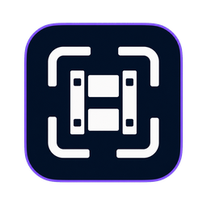
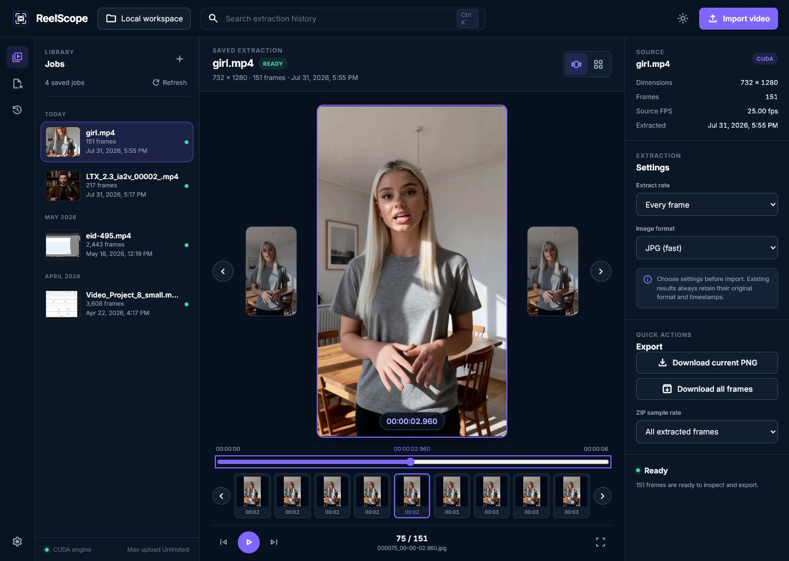

# ReelScope



ReelScope is a private, local-first video frame explorer for Windows. Drop in a video, extract exact frames with CPU or NVIDIA CUDA acceleration, scrub the result as a timeline, reopen past jobs, and export a single PNG or a sampled ZIP.



## What it does

- Persistent project history with search and instant reopening
- Ratio-aware frame stage for landscape, portrait, square, and ultrawide video
- Filmstrip, grid, keyboard navigation, playback, and precise frame selection
- Light and dark themes
- CPU extraction everywhere; CUDA acceleration when a compatible FFmpeg build and NVIDIA driver are available
- Web UI plus a native Edge WebView2 desktop window with no background command prompt
- Local processing: uploaded videos and extracted frames stay on your computer

## Quick start

### CUDA web app

Run `run_web_cuda.bat`, then open `http://localhost:8003`. The launcher pins the CUDA-capable FFmpeg installed at `%USERPROFILE%\anaconda3\Library\bin` so a different FFmpeg earlier on `PATH` cannot be selected accidentally.

### CPU web app

Run `run_web.bat`, then open `http://localhost:8002`.

### Desktop shortcut

From PowerShell:

```powershell
.\install_desktop.ps1 -Launch
```

This creates a `ReelScope` shortcut on the Windows desktop and launches it through `pythonw.exe`, so no console window remains open. When run from source it reuses the existing `web_data_cuda` history.

### Standalone desktop build

```powershell
.\build_desktop.ps1 -InstallShortcut
```

The packaged app is written to `dist\ReelScope\ReelScope.exe`. Packaged builds store their library under `%LOCALAPPDATA%\ReelScope\data`.

## CUDA requirements

ReelScope checks the output of `ffmpeg -hwaccels` and selects CUDA only when the chosen build reports it. The CUDA launcher expects matching `ffmpeg.exe` and `ffprobe.exe` files in the Anaconda installation. The NVIDIA driver must support the decoder used by the source video.

If CUDA is unavailable, the desktop app falls back to the CPU extractor. The web CUDA launcher stops with a clear error instead of silently using an unrelated FFmpeg build.

## Controls

- Left/right arrow: previous or next frame
- Space: play or pause the filmstrip
- Home/End: first or last frame
- `G`: toggle filmstrip/grid view
- Theme button: follow system, light, or dark appearance

## Development

```powershell
py -3 -m venv .venv
.\.venv\Scripts\python.exe -m pip install -r requirements-desktop.txt
.\.venv\Scripts\python.exe -m unittest discover -s tests -v
```

The UI is plain HTML, CSS, and JavaScript served by Flask. No external CDN is required at runtime.

## Privacy and data

ReelScope has no account system, analytics, cloud upload, or telemetry. Browser mode binds to all local interfaces by default; if you do not want other devices on your network to reach it, use the desktop build or change the Flask host to `127.0.0.1`.

## License

ReelScope is released under the [MIT License](LICENSE). Bundled font and icon licenses are listed in [THIRD_PARTY_NOTICES.md](THIRD_PARTY_NOTICES.md).
